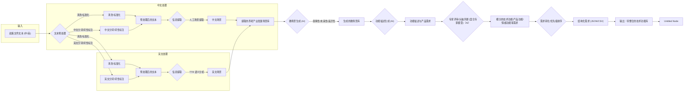

```mermaid
flowchart LR
 subgraph s1["输入"]
        A["政策文件文本 (中/英)"]
  end
 subgraph s2["中文处理"]
        C["清洗/标准化"]
        B{"文本预处理"}
        D["中文分词/词性标注"]
        F["预处理后的文本"]
        G{"信息提取"}
        H["中文场景"]
        J["提取的养老产业发展场景库"]
  end
 subgraph s3["英文处理"]
        C2["清洗/标准化"]
        E["英文分词/词性标注"]
        F2["预处理后的文本"]
        G2{"信息提取"}
        I["英文场景"]
  end
    A --> B
    B -- 清洗/标准化 --> C & C2
    B -- 中文分词/词性标注 --> D
    C --> F
    D --> F
    F --> G
    G -- 人工场景提取 --> H
    H --> J
    B -- 英文分词/词性标注 --> E
    C2 --> F2
    E --> F2
    F2 --> G2
    G2 -- TTR 语义分析 --> I
    I --> J
    J --> K{"微场景生成 (AI)"}
    K -- 叙事性/未来性/差异性 --> L["生成的微场景库"]
    L --> M{"功能描述生成 (AI)"}
    M --> N["功能描述与产品需求"]
    N --> O{"专家评审/头脑风暴 (混合专家模型)（AI）"}
    O --> P["细分的技术功能/产品功能/情绪功能等需求"]
    P --> Q{"需求转化/优先级排序"}
    Q --> R["结构化需求 (JSON/CSV)"]
    R --> S["输出：待整合的技术功能库"]
     --> n1["Untitled Node"]


```