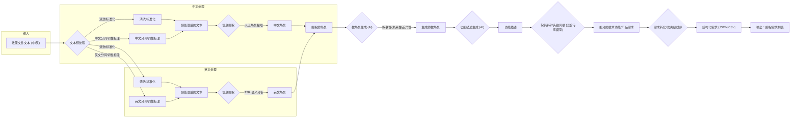

```mermaid
flowchart LR
    subgraph 输入
        A["政策文件文本 (中/英)"]
    end
    A --> B{"文本预处理"}
    subgraph 中文处理
        B -- 清洗/标准化 --> C["清洗/标准化"]
        B -- 中文分词/词性标注 --> D["中文分词/词性标注"]
        C --> F["预处理后的文本"]
        D --> F
        F --> G{"信息提取"}
        G -- 人工场景提取 --> H["中文场景"]
        H --> J["提取的场景"]
    end
    subgraph 英文处理
        B -- 清洗/标准化 --> C2["清洗/标准化"]
        B -- 英文分词/词性标注 --> E["英文分词/词性标注"]
        C2 --> F2["预处理后的文本"]
        E --> F2
        F2 --> G2{"信息提取"}
        G2 -- TTR 语义分析 --> I["英文场景"]
        I --> J
    end
    J --> K{"微场景生成 (AI)"}
    K -- 叙事性/未来性/差异性 --> L["生成的微场景"]
    L --> M{"功能描述生成 (AI)"}
    M --> N["功能描述"]
    N --> O{"专家评审/头脑风暴 (混合专家模型)"}
    O --> P["细分的技术功能/产品需求"]
    P --> Q{"需求转化/优先级排序"}
    Q --> R["结构化需求 (JSON/CSV)"]
    R --> S["输出：编程需求列表"]

```